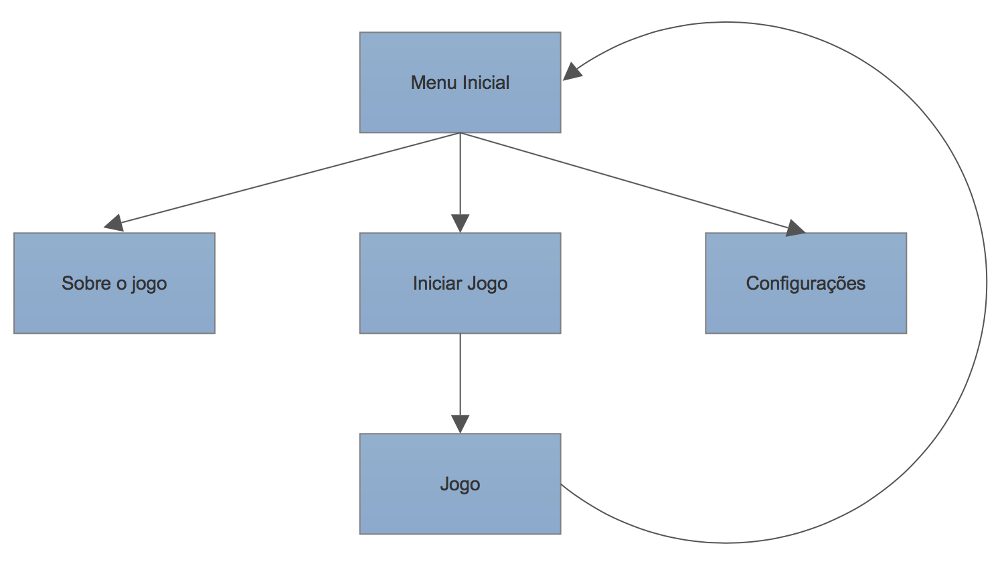
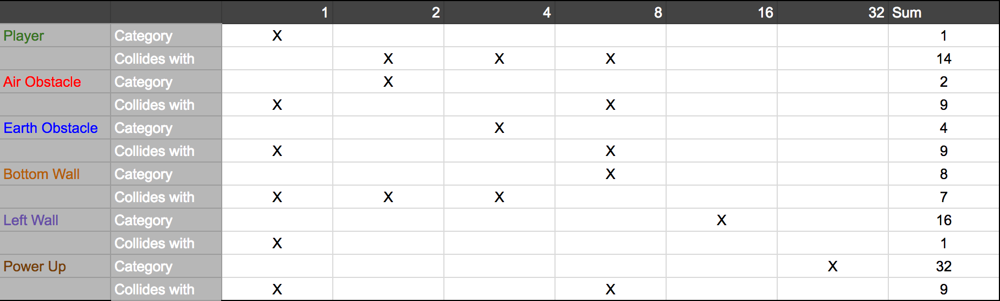

# Time Runner

### Sumário

* [Enredo](#enredo)
* [Objetivo Geral](#objetivo-geral)
* [Objetivos Específicos](#objetivos-específicos)
* [Regras do Jogo](#regras-do-jogo)
* [Diagrama de Navegação](#diagrama-de-navegação)
* [Tabela de colisão](#tabela-de-colisão)
* [Imagens](#imagens)
* [Pontos Importantes](#pontos-importantes)
* [Anotações](#anotações)
* [Licença](#license)

#### Enredo

**Time Runner** é um jogo feito para dispositivos móveis. Inspirado em um
[post](http://www.reddit.com/r/gameideas/comments/3frqt9/need_idea_for_a_simple_yet_fun_mobile_game/),
tem como objetivo fazer o jogador entrar numa *viagem* através da história de forma divertida, além de testar o tempo
de reação do jogador.

#### Objetivo Geral

* Fazer com que o jogador melhore seu tempo de reação no jogo

#### Objetivos Específicos

* Desviar dos obstáculos
* Durar o máximo de tempo que conseguir

#### Regras do Jogo

* Ao ser atingido por um obstáculo o jogador perderá o jogo
* A pontuação do jogador será o seu tempo no jogo em segundos
* O jogador poderá ser atingido apenas 5 vezes por um obstáculo
* A cada 300s o jogo trocará de tempo, ou seja, o cenário irá mudar pra um
um novo background se adaptando ao novo período de tempo

#### Diagrama de navegação

#### Tabela de colisão

#### Imagens

- Menu principal

- Jogo

- Sobre

#### Pontos Importantes

- Um jogo onde você joga como um cientista louco viajante
- Você toca na tela para saltar sobre obstáculos e desliza para derrubar inimigos
- Você começa cada jogo saindo de um portal para um período no tempo
- Você tem que saltar por cima de coisas como pântanos e tocos de árvores, com insetos gigantes atacando você através
da história
- Se você sobreviver por tempo suficiente, a floresta começa gradualmente a diluir-se para fora, o chão fica mais seco,
e os dinossauros começam a aparecer como inimigos
- O jogo inteiro vai ser assim e quanto mais tempo você permanecer vivo, o jogo vai ficando mais difícil
- Gráficos simples e fundos repetidamente gerados irá tornar mais fácil para produzir uma abundância de diferentes
períodos de tempo
- Por meio de antigos animais para os seres humanos primitivos para a civilização antiga, através da história
registrada e culminando nas ruínas de uma colônia espacial de alta tecnologia, que você vai continuar a correr no
"para sempre" se você chegar a esse ponto
- Encontrar novos tempos dar um incentivo para o progresso, além do mecânico normal dos recordes. Simples e viciante,
mas com um único ponto de venda interessante.

#### Anotações

- Veja algumas imagens da evolução do jogo [aqui](./docs/PROGRESS_IMAGES.md).
- Veja algumas referências utilizadas no jogo [aqui](./docs/REFERENCES.md).

#### Tecnologias utilizadas

- Corona Simulator - Version 2016.2830 (2016.2.18)

#### License

    Copyright 2015 Pedro Rodrigues

    Licensed under the Apache License, Version 2.0 (the "License");
    you may not use this file except in compliance with the License.
    You may obtain a copy of the License at

        http://www.apache.org/licenses/LICENSE-2.0

    Unless required by applicable law or agreed to in writing, software
    distributed under the License is distributed on an "AS IS" BASIS,
    WITHOUT WARRANTIES OR CONDITIONS OF ANY KIND, either express or implied.
    See the License for the specific language governing permissions and
    limitations under the License.